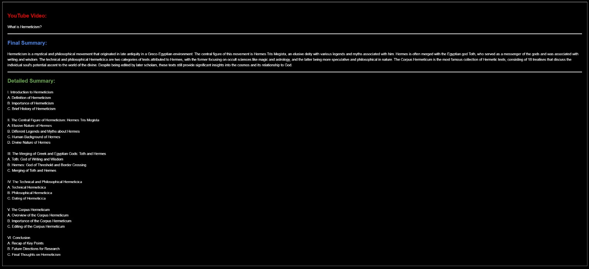
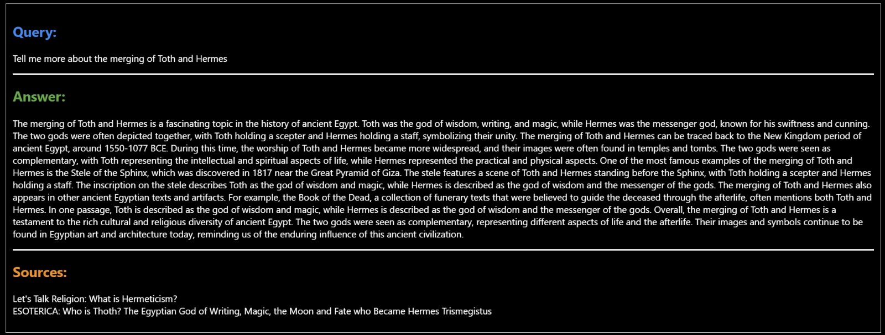

# No Time to Watch: Building an AI-Powered Video Understanding System
How many times have you wanted to watch multiple YouTube videos but didn’t have enough time? Enter our latest project: an AI-powered YouTube Knowledge Base built with Retrieval-Augmented Generation (RAG) and Large Language Models (LLMs).

 <br>
*A visual representation of our AI assistant*

## The Challenge
YouTube video transcripts are packed with useful information, but they can be hard to search through and analyze. They're often long and unorganized, making it tough to quickly find what you're looking for or fully understand the content.

## Our Solution
We’ve built a system that uses natural language processing (NLP) techniques, vector databases, and large language models (LLMs) to create a searchable and queryable knowledge base from YouTube videos.

### Key Highlights:
- **Fully Local Deployment**: Our entire system runs locally on your machine, ensuring data privacy and reducing dependency on external services.
- **Open-Source Stack**: This solution uses entirely open-source libraries, making it accessible, customizable, and free to use.

### Key Components:

1. **Video Data Extraction**: Fetching transcripts and metadata from YouTube videos.
2. **Punctuation Restoration**: Adding punctuation to video transcripts to improve readability.
3. **Semantic Chunking**: Breaking down transcripts into meaningful segments.
4. **Vector Database**: Storing and retrieving processed content efficiently using ChromaDB.
5. **Large Language Model**: Generating human-like responses to queries.

Let’s zoom in on how we built this system.

## Part 1: Knowledge Acquisition
You can find the complete details for part 1 in the following [Jupyter Notebook](NTTW/notebook/Part 1 - Getting Knowledge.ipynb).

### Harnessing GPU Power
To ensure optimal performance, we leverage GPU acceleration when available. This significantly speeds up our processing, especially when dealing with large volumes of video data.

```python
device = get_device()
print(f"Using device: {device}")

GPU is available
GPU name: NVIDIA GeForce RTX 4090 Laptop GPU
```

### Building Our Knowledge Repository
Our core system is a vector database built with Chroma. This database allows us to efficiently store and retrieve our processed video content. We use the 'all-MiniLM-L6-v2' model to create embeddings, which are numerical representations of our text data that capture semantic meaning.

```Python
model_name = 'all-MiniLM-L6-v2'
encoder_model, max_seq_length, collection, client = setup_vector_db(
    model_name=model_name,
    path_name='./data/vectordb', 
    collection_name='youtube_knowledgebase', 
    device=device
)
```

### From Video to Data
We fetch transcripts and metadata for each video using YouTube's API. This step transforms the video content into a format we can process and analyze.

### Semantic Chunking and the Meaning of Words
Using semantic chunking helps us to break down the transcript into meaningful segments, preserving context and making retrieval more accurate. Here’s how it works:
1. Restore punctuation in the transcript to enhance readability. This step helps in accurately segmenting the text into sentences.
2. Using spaCy's NLP model, we divide the transcript into individual sentences. This segmentation is crucial for the subsequent analysis.
3. Each sentence is converted into a numerical representation (embedding) using a SentenceTransformer model.
4. We calculate the similarity between consecutive sentences using cosine similarity. This helps determine whether sentences are contextually related.
5. Sentences are grouped into chunks based on their similarity. We aim to keep chunks coherent by ensuring each group does not exceed a specified number of sentences. Sentences with similarity above a certain threshold are added to the current group; otherwise, a new group is started.
6. Finally, we combine the sentences in each group into a coherent text chunk. These chunks represent semantically meaningful segments of the original transcript.

### Populating Our Knowledge Base
Finally, we process our chunks and store them in our vector database. Each chunk is associated with its embedding, metadata, and the original video ID, allowing for efficient retrieval later.

```python
for video_data, chunks in tqdm(zip(video_data_list, chunks_list), total=len(video_data_list)):
    processed_chunks, embeddings = process_chunks(chunks, max_seq_length, encoder_model)
    populate_database(collection, processed_chunks, embeddings, video_data['metadata'], video_data['video_id'])
```

## Part 2: Knowledge Retrieval
Having built our knowledge base, it's time to explore how to effectively use it. As with Part 1, detailed instructions for this section can be found in the [Jupyter Notebook](NTTW/notebook/Part 2 - Retrieving Knowledge.ipynb).

### Accessing Our Knowledge Base
We start by connecting to our Chroma database, which now contains all the processed information from our YouTube videos.

```python
client = chromadb.PersistentClient(path='data/vectordb')
collection = client.get_collection(name='youtube_knowledgebase')
```

### The Language Model: Our AI Assistant
For generating responses, we use Mistral-7B-Instruct model. This large language model allows us to generate human-like text based on the information in our database.

```python
# initialize Mistral model
model_id = "mistralai/Mistral-7B-Instruct-v0.1"
tokenizer = AutoTokenizer.from_pretrained(model_id)

# set quantization configuration
bnb_config = transformers.BitsAndBytesConfig(
    load_in_4bit=True,
    bnb_4bit_quant_type='nf4',
    bnb_4bit_use_double_quant=True,
    bnb_4bit_compute_dtype=torch.bfloat16
)

# load the Mistral model
model = AutoModelForCausalLM.from_pretrained(
    model_id,
    device_map=device,
    trust_remote_code=True,
    torch_dtype=torch.bfloat16,
    quantization_config=bnb_config,
)

# create a pipeline
pipe = pipeline(
    "text-generation",
    model=model,
    tokenizer=tokenizer,
    max_new_tokens=4000,
    temperature=0.6, # Higher values (e.g., 1.0) make output more random, lower values (e.g., 0.1) make it more deterministic.
    top_p=0.9 # The model considers the smallest set of tokens whose cumulative probability exceeds this value.
    )
```

### Understanding Video Structure
A key feature of our system is its capability to generate summaries of video content. By supplying the model with the complete context of a video, we can request a structured summary that outlines the main topics and key points discussed.

 <br>
*Summary and  main topics discussed in the video*

### Asking Questions, Getting Answers
Another interesting feature of our system is its ability to answer questions about the video content. We use a combination of vector similarity search and re-ranking to find the most relevant chunks of information for a given query. Then, we use our language model to generate a detailed, coherent answer based on this context.

 <br>
*Question answering task*

## Conclusions
Our YouTube Knowledge Base project demonstrates the power of combining RAG with LLMs for video content analysis. This approach opens up exciting possibilities:

1. **Enhanced Learning**: Students can quickly find and understand key concepts from educational videos.
2. **Content Creation**: YouTubers can easily analyze their own and competitors' content for insights.
3. **Research**: Academics can efficiently extract information from video lectures and presentations.

What ideas do you have for applying this technology? I’d love to hear your thoughts. If you have any feedback or want to connect, feel free to reach out on [LinkedIn](https://www.linkedin.com/in/dgarciarieckhof/)!

